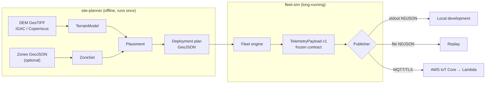

# PyroSense Simulator

**Simulates the IoT sensor fleet that detects wildfires before they make the
news** — the simulation subsystem of PyroSense, a serverless AWS platform for
early wildfire detection, motivated by the January 2024 fires in Bogotá's
Cerros Orientales, when late detection left the city under smoke for days.

This repository answers two questions in software, before buying a single
sensor: **where should the nodes go?** (site-planner, over a real digital
elevation model) and **how does the platform behave under realistic fleet
traffic?** (fleet-sim, which emits contract-validated telemetry). The AWS
infrastructure lives in its own repository.

## Architecture



The boundary between this subsystem and the cloud is the
**[v1 data contract](docs/data-contract.md)**: a frozen pydantic payload,
exported as [JSON Schema](docs/payload-schema-v1.json) and guarded by an
anti-drift test.

## Requirements and installation

Python ≥ 3.12. Recommended with [uv](https://docs.astral.sh/uv/) (it manages
the interpreter itself):

```bash
git clone git@github.com:jssutachan/PyroSense-Simulator.git
cd PyroSense-Simulator
uv venv --python 3.12
source .venv/bin/activate
uv pip install -e ".[dev]"
cp .env.example .env        # placeholders; real values are never committed
```

The site-planner needs a real DEM: follow [data/README.md](data/README.md)
(IGAC "Colombia en Mapas" or Copernicus GLO-30 via OpenTopography).

## Usage

**Generate the deployment plan:**

```bash
# With reasoned defaults (T1 1 node/4 ha, T2 1/10 ha, T3 1/25 ha, seed 0):
site-planner generate --dem data/dem_cerros_orientales.tif \
    --aoi config/reserve.geojson --out out/

# With custom parameters and a PNG preview (pip install "pyrosense-sim[preview]"):
cp config/params.example.yaml config/params.yaml   # adjust densities/seed
site-planner generate --dem data/dem_cerros_orientales.tif \
    --aoi config/reserve.geojson --config config/params.yaml --out out/ --preview
```

This produces `out/sensors.geojson` (the fleet simulator's input),
`out/gateways.geojson` and `out/site-report.md` with achieved densities,
slope-relocated nodes and the seed used. **Same seed + same inputs ⇒
byte-identical output** ([ADR-0007](docs/adr/ADR-0007-deterministic-plan.md));
the AOI is a GeoJSON polygon (FeatureCollection, Feature or bare geometry).

**Simulate the fleet** (no AWS credentials or connectivity required):

```bash
# 24 h of the baseline scenario at 1 simulated hour per real minute, NDJSON to stdout:
fleet-sim run --site out/sensors.geojson --scenario scenarios/baseline.yaml \
    --publisher stdout --speed 60 > telemetry.ndjson

# El Niño dry season, to a size-rotated file:
fleet-sim run --site out/sensors.geojson --scenario scenarios/dry_season.yaml \
    --publisher file --out out/telemetry.ndjson --speed 3600

# Parametric replay of the January 2024 fire (multi-sensor correlation):
fleet-sim run --site out/sensors.geojson --scenario scenarios/january_2024_replay.yaml \
    --publisher stdout --speed 600

# Degraded network: dropouts, reconnection burst with old timestamps,
# QoS 1 duplicates, reordering and draining batteries:
fleet-sim run --site out/sensors.geojson --scenario scenarios/faults.yaml \
    --publisher stdout --speed 600

# Load test (~25x baseline volume: 5x fleet + 60 s cadence):
fleet-sim run --site out/sensors.geojson --scenario scenarios/load_test.yaml \
    --publisher stdout --speed 3600 > /dev/null   # measure via the stderr logs

# Toward AWS IoT Core: mutual TLS + QoS 1; credentials ALWAYS via .env
# (see .env.example and config/publisher.example.yaml):
fleet-sim run --site out/sensors.geojson --scenario scenarios/baseline.yaml \
    --publisher mqtt --speed 60
```

Data flows through stdout and logs through stderr
([ADR-0010](docs/adr/ADR-0010-stdout-data-channel.md)), so pipes stay clean.
Ctrl-C shuts down cleanly with a summary (total emitted, per-status
breakdown, simulated vs real duration). The same scenario seed reproduces
the exact same payload sequence.

**Export the contract as JSON Schema** (for the cloud team):

```bash
python -m pyrosense_sim.contracts.export_schema > docs/payload-schema-v1.json
```

**Query a DEM from Python:**

```python
from pyrosense_sim.planner.terrain import TerrainModel

terrain = TerrainModel("data/dem_cerros_orientales.tif")
print(terrain)                          # TerrainModel(1200x1100 cells, lon [...], lat [...])
print(terrain.elevation_at(-74.04, 4.61), "m")
print(terrain.slope_at(-74.04, 4.61), "deg")
```

**Classify points by priority zone:**

```python
from shapely.geometry import box
from pyrosense_sim.planner.zones import ZoneSet

aoi = box(-74.10, 4.50, -74.00, 4.60)
zones = ZoneSet.derive_default(aoi)     # T1 = western wildland-urban interface
print(zones.tier_of(-74.099, 4.55))     # 1
```

**Emit validated telemetry as NDJSON:**

```python
from datetime import UTC, datetime
from pyrosense_sim.contracts.telemetry import DeviceStatus, TelemetryPayload
from pyrosense_sim.publishers.stdout import StdoutPublisher

payload = TelemetryPayload(
    device_id="PYRO-T1-0042", gateway_id="GW-01",
    ts_device=datetime.now(UTC), seq=0,
    lat=4.6097, lon=-74.04, elevation_m=3050.0,
    temp_c=18.5, rh_pct=65.0, smoke_ppm=0.02,
    wind_speed_ms=None, wind_dir_deg=None,
    battery_pct=88.0, status=DeviceStatus.OK,
)
StdoutPublisher().publish(payload)
```

**Quality checks** (the full checklist lives in
[docs/CONTRIBUTING.md](docs/CONTRIBUTING.md)):

```bash
ruff check . && ruff format --check .   # style
mypy                                     # types (strict, src + tests)
pytest                                   # tests + coverage threshold
mkdocs build                             # documentation
mkdocs serve                             # docs at http://127.0.0.1:8000
```

## Repository layout

```
├── src/pyrosense_sim/
│   ├── contracts/     # v1 payload (pydantic) + JSON Schema exporter — THE boundary
│   ├── publishers/    # Publisher protocol + stdout/file (NDJSON) + MQTT (IoT Core, QoS 1)
│   ├── planner/       # site-planner: terrain, zones, placement, gateways, plan, CLI
│   └── fleet/         # fleet-sim: scenarios, environment, nodes, fire, faults, CLI
├── tests/             # mirrors src/; synthetic DEMs, zero external data
├── docs/              # architecture, contract, ADRs, contributing (MkDocs site)
├── config/            # program configuration and examples
├── scenarios/         # declarative simulation scenarios
└── data/              # real DEM (not committed) + download guide
```

## Documentation

- **[Architecture guide](docs/architecture.md)** — the full design in 10 minutes.
- **[Data contract v1](docs/data-contract.md)** — field by field, with the why.
- **[API reference](docs/reference.md)** — generated from docstrings (`mkdocs serve`).
- **[CHANGELOG](CHANGELOG.md)** — one entry per release.

## The 5 design decisions (and why)

1. **Two programs, not one** — planning (offline, geospatial-heavy, runs
   once) and simulating (long-running, I/O-heavy) have different life cycles
   and dependencies; the intermediate GeoJSON plan is inspectable,
   versionable and editable between stages →
   [ADR-0001](docs/adr/ADR-0001-two-programs.md).
2. **QoS 1 with deduplication in the cloud** — losing readings is
   unacceptable and exactly-once does not exist in IoT Core; the payload
   carries `device_id`+`seq` from day one so the ingestion Lambda can be
   idempotent. The simulator trains that responsibility with the
   `duplicates` fault →
   [ADR-0013](docs/adr/ADR-0013-qos1-dedupe-in-the-cloud.md).
3. **Adaptive sampling is the origin of the burst pattern** — a node seeing
   elevated conditions switches from 300 s to 30 s on its own; a real fire
   therefore produces a spatially correlated burst of messages (verified:
   nodes inside the fire zone emit 4–6x more). The pipeline must be sized
   for that peak, not the average — and `scenarios/load_test.yaml` stresses
   it on purpose.
4. **Gateways are metadata: no radio simulation** — `ceil(n/60)` k-means
   clusters snapped to high ground provide the `gateway_id` the payload
   needs, without derailing the project into an RF problem outside its
   goal → [ADR-0008](docs/adr/ADR-0008-gateways-as-metadata.md).
5. **Deliberately no fire physics** — `FireEvent` is parametric
   interpolation (circle + wind drift + smooth ramp) producing the
   multi-sensor *signature* detection needs; Rothermel/FARSITE would demand
   data that doesn't exist and wouldn't improve pipeline validation →
   [ADR-0011](docs/adr/ADR-0011-parametric-fire.md).

The full record (13 decisions): [ADRs](docs/adr/index.md) — frozen contract,
pydantic at the boundary, Git Flow, sensors-report-health, tooling,
deterministic plan, noise-in-the-sensor, stdout-as-data-channel,
faults-as-decorator.
