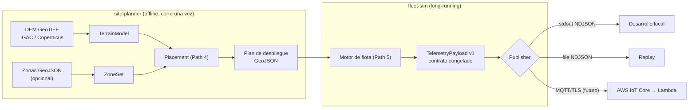

# PyroSense Simulator

**Simula la flota de sensores IoT que detecta incendios forestales antes de que sean
noticia** — el subsistema de simulación de PyroSense, una plataforma serverless en AWS
de detección temprana, motivada por los incendios de los Cerros Orientales de Bogotá
de enero de 2024, cuando la detección tardía dejó a la ciudad días bajo el humo.

Este repo responde dos preguntas por software, antes de comprar un solo sensor:
**¿dónde ubicar los nodos?** (site-planner, sobre un modelo digital de elevación real)
y **¿cómo se comporta la plataforma con tráfico de flota realista?** (fleet-sim, que
emite telemetría validada por contrato). La infraestructura AWS vive en su propio repositorio.

## Arquitectura



La frontera entre este subsistema y la nube es el **[contrato de datos v1](docs/data-contract.md)**:
un payload pydantic congelado, exportado como [JSON Schema](docs/payload-schema-v1.json)
y protegido por un test anti-drift.

## Requisitos e instalación

Python ≥ 3.12. Recomendado con [uv](https://docs.astral.sh/uv/) (gestiona el intérprete solo):

```bash
git clone git@github.com:jssutachan/PyroSense-Simulator.git
cd PyroSense-Simulator
uv venv --python 3.12
source .venv/bin/activate
uv pip install -e ".[dev]"
cp .env.example .env        # placeholders; los valores reales nunca se versionan
```

Para el site-planner necesitas un DEM real: sigue [data/README.md](data/README.md)
(IGAC "Colombia en Mapas" o Copernicus GLO-30 vía OpenTopography).

## Uso

**Generar el plan de despliegue** (el CLI principal; `fleet-sim` llega con el Path 5):

```bash
# Con parámetros por defecto (T1 1/4ha, T2 1/10ha, T3 1/25ha, semilla 0):
site-planner generate --dem data/dem_cerros_orientales.tif \
    --aoi config/reserva.geojson --out out/

# Con configuración propia y preview PNG (requiere: pip install "pyrosense-sim[preview]"):
cp config/params.example.yaml config/params.yaml   # y ajusta densidades/semilla
site-planner generate --dem data/dem_cerros_orientales.tif \
    --aoi config/reserva.geojson --config config/params.yaml --out out/ --preview
```

Produce `out/sensores.geojson` (entrada del fleet-sim), `out/gateways.geojson` y
`out/site-report.md` con densidades logradas, nodos reubicados por pendiente y la
semilla usada. **Misma semilla + mismos insumos ⇒ salida byte-idéntica**
([ADR-0007](docs/adr/ADR-0007-plan-determinista.md)); el AOI es un GeoJSON con el
polígono del área (FeatureCollection, Feature o geometría directa).

**Simular la flota** (sin ninguna credencial ni conexión AWS):

```bash
# 24 h del escenario base a 1 h simulada por minuto real, NDJSON a stdout:
fleet-sim run --site out/sensores.geojson --scenario scenarios/baseline.yaml \
    --publisher stdout --speed 60 > telemetry.ndjson

# Temporada seca estilo El Niño, a archivo con rotación:
fleet-sim run --site out/sensores.geojson --scenario scenarios/temporada_seca.yaml \
    --publisher file --out out/telemetry.ndjson --speed 3600

# Replay paramétrico del incendio de enero 2024 (correlación multi-sensor):
fleet-sim run --site out/sensores.geojson --scenario scenarios/replay_enero_2024.yaml \
    --publisher stdout --speed 600

# Red degradada: dropout, ráfaga de reconexión con timestamps viejos,
# duplicados QoS 1, desorden y baterías cayendo:
fleet-sim run --site out/sensores.geojson --scenario scenarios/fallos.yaml \
    --publisher stdout --speed 600

# Prueba de carga (~25x el volumen del baseline: flota 5x + cadencia 60 s):
fleet-sim run --site out/sensores.geojson --scenario scenarios/carga.yaml \
    --publisher stdout --speed 3600 > /dev/null   # medir con los logs de stderr

# Hacia AWS IoT Core (cuando exista la etapa E2): TLS mutua + QoS 1;
# credenciales SIEMPRE por .env (ver .env.example y config/publisher.example.yaml):
fleet-sim run --site out/sensores.geojson --scenario scenarios/baseline.yaml \
    --publisher mqtt --speed 60
```

Los datos van por stdout y los logs por stderr ([ADR-0010](docs/adr/ADR-0010-stdout-canal-de-datos.md)),
así que los pipes quedan limpios. Ctrl-C cierra ordenado con resumen (total emitido,
desglose por status, duración simulada vs real). Misma semilla de escenario ⇒ misma
secuencia exacta de payloads.

**Exportar el contrato como JSON Schema** (para el equipo cloud):

```bash
python -m pyrosense_sim.contracts.export_schema > docs/payload-schema-v1.json
```

**Consultar un DEM desde Python:**

```python
from pyrosense_sim.planner.terrain import TerrainModel

terrain = TerrainModel("data/dem_cerros_orientales.tif")
print(terrain)                          # TerrainModel(1200x1100 cells, lon [...], lat [...])
print(terrain.elevation_at(-74.04, 4.61), "m")
print(terrain.slope_at(-74.04, 4.61), "deg")
```

**Clasificar puntos por zona de prioridad:**

```python
from shapely.geometry import box
from pyrosense_sim.planner.zones import ZoneSet

aoi = box(-74.10, 4.50, -74.00, 4.60)
zones = ZoneSet.derive_default(aoi)     # T1 = interfaz urbana occidental (simplificación documentada)
print(zones.tier_of(-74.099, 4.55))     # 1
```

**Emitir telemetría validada a NDJSON:**

```python
from datetime import UTC, datetime
from pyrosense_sim.contracts.telemetry import DeviceStatus, TelemetryPayload
from pyrosense_sim.publishers.stdout import StdoutPublisher

payload = TelemetryPayload(
    device_id="PYRO-T1-0042", gateway_id="GW-01",
    ts_device=datetime.now(UTC), seq=0,
    lat=4.6097, lon=-74.04, elevation_m=3050.0,
    temp_c=18.5, rh_pct=65.0, smoke_ppm=0.02,
    wind_speed_ms=None, wind_dir_deg=None,
    battery_pct=88.0, status=DeviceStatus.OK,
)
StdoutPublisher().publish(payload)
```

**Verificación de calidad** (la checklist completa está en [docs/CONTRIBUTING.md](docs/CONTRIBUTING.md)):

```bash
ruff check . && ruff format --check .   # estilo
mypy                                     # tipos (strict, src + tests)
pytest                                   # tests + cobertura (umbral 90, real 100 %)
mkdocs build                             # documentación
mkdocs serve                             # docs en http://127.0.0.1:8000
```

## Estructura del repositorio

```
├── src/pyrosense_sim/
│   ├── contracts/     # Payload v1 (pydantic) + exportador de JSON Schema — LA frontera
│   ├── publishers/    # Protocol Publisher + stdout/file (NDJSON) + MQTT (IoT Core, QoS 1)
│   ├── planner/       # site-planner: terreno, zonas, placement, gateways, plan y CLI
│   └── fleet/         # fleet-sim: escenario, ambiente, nodos, scheduler y CLI
├── tests/             # espeja src/; DEMs sintéticos, cero datos externos
├── docs/              # arquitectura, contrato, ADRs, contribución (sitio MkDocs)
├── config/            # configuración de los programas
├── scenarios/         # escenarios de simulación declarativos
└── data/              # DEM real (no versionado) + guía de descarga
```

## Documentación

- **[Guía de arquitectura](docs/architecture.md)** — el diseño completo en 10 minutos.
- **[Contrato de datos v1](docs/data-contract.md)** — campo por campo, con su porqué.
- **[Referencia de API](docs/reference.md)** — generada desde docstrings (`mkdocs serve`).
- **[CHANGELOG](CHANGELOG.md)** — una entrada por path.

## Las 5 decisiones de diseño (y su porqué)

1. **Dos programas, no uno** — planificar (offline, geoespacial-pesado, corre una
   vez) y simular (long-running, I/O-pesado) tienen ciclos de vida y dependencias
   distintos; el plan GeoJSON intermedio es inspeccionable, versionable y editable
   entre etapas → [ADR-0001](docs/adr/ADR-0001-dos-programas.md).
2. **QoS 1 con deduplicación en la nube** — perder lecturas es inaceptable y
   exactly-once no existe en IoT Core; el payload carga `device_id`+`seq` desde el
   día uno para que la Lambda sea idempotente. El simulador entrena esa
   responsabilidad con el fallo `duplicates` → [ADR-0013](docs/adr/ADR-0013-qos1-dedupe-en-nube.md).
3. **La frecuencia adaptativa es el origen del patrón de ráfaga** — un nodo que ve
   condiciones elevadas pasa de 300 s a 30 s por sí solo; un incendio real produce
   entonces una ráfaga espacialmente correlacionada de mensajes (verificado: los
   nodos en zona de fuego emiten 4–6× más). El pipeline debe dimensionarse para
   ese pico, no para el promedio — y el escenario `carga.yaml` lo estresa a
   propósito.
4. **El gateway es metadato: no se simula radio** — `ceil(n/60)` clusters k-means
   con snap a terreno alto dan el `gateway_id` que el payload necesita, sin
   desviar el proyecto a un problema de RF que no es su objetivo →
   [ADR-0008](docs/adr/ADR-0008-gateways-metadato.md).
5. **Cero física de fuego, deliberadamente** — `FireEvent` es interpolación
   paramétrica (círculo + viento + rampa suave) que produce la *firma* multi-sensor
   que la detección necesita; Rothermel/FARSITE exigirían datos que no existen y
   no mejorarían la validación del pipeline →
   [ADR-0011](docs/adr/ADR-0011-fuego-parametrico.md).

El registro completo (13 decisiones): [ADRs](docs/adr/index.md) — contrato
congelado, Pydantic-frontera, Git Flow, sensor-no-alerta, tooling, plan
determinista, ruido-en-el-sensor, stdout-canal-de-datos, fallos-como-decorador.
