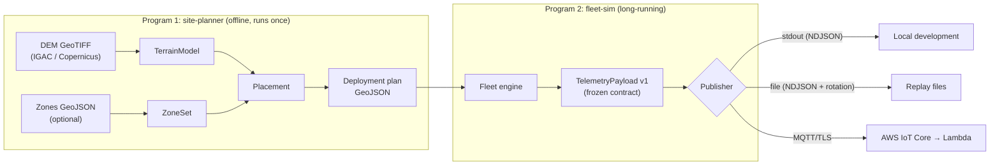

# Architecture guide

**Reading goal:** understand the full subsystem design in ~10 minutes,
without having seen the code before.

## The problem

In January 2024, Bogotá's Cerros Orientales (eastern hills) burned for days;
late detection was part of the problem. PyroSense proposes a mesh of low-cost
IoT sensors (temperature, humidity, smoke) reporting to a serverless AWS
platform that infers fire risk in real time.

Before deploying real hardware, two questions must be answered in software:

1. **Where should the sensors go?** — answered by the **site-planner**.
2. **Can the platform handle the fleet's real traffic?** — answered by the
   **fleet-sim**, which generates realistic telemetry to develop and test the
   backend without hardware.

This repository contains both programs. The AWS infrastructure lives in its
own repository.

## Bird's-eye view

## Modules and their responsibilities

| Module | Responsibility (a single one) | Status |
|---|---|---|
| `contracts/telemetry.py` | Define and validate the v1 payload — the boundary with the cloud | ✅ frozen |
| `contracts/export_schema.py` | Materialize the contract as JSON Schema for non-Python consumers | ✅ |
| `publishers/base.py` | The `Publisher` abstraction (publish/close) everything else depends on | ✅ |
| `publishers/ndjson.py` | Single source of truth for the NDJSON line format | ✅ |
| `publishers/stdout.py`, `publishers/file.py` | AWS-free transports: development and replay | ✅ |
| `publishers/mqtt.py` | AWS IoT Core transport: mutual TLS, QoS 1, backoff+jitter, metrics (ADR-0013) | ✅ |
| `planner/terrain.py` | DEM → elevation and slope queries (normalizes to EPSG:4326) | ✅ |
| `planner/zones.py` | T1/T2/T3 priority polygons and point classification | ✅ |
| `planner/geo.py` | Degree↔meter conversion (single source of the approximation) | ✅ |
| `planner/placement.py` | Hexagonal grid per tier with seeded jitter and slope relocation | ✅ |
| `planner/gateways.py` | k-means clustering of nodes with high-ground gateway snap (metadata only) | ✅ |
| `planner/site_plan.py` | Assembles the plan and serializes the 3 deterministic artifacts | ✅ |
| `planner/params.py` / `planner/cli.py` | Boundary-validated YAML config + the `site-planner` CLI | ✅ |
| `fleet/config.py` | Scenario YAML boundary (strict pydantic) | ✅ |
| `fleet/environment.py` | Pure ground truth: diurnal cycle, lapse rate, anticorrelated humidity | ✅ |
| `fleet/node.py` | The noisy instrument: own RNG, `seq`, battery, adaptive cadence | ✅ |
| `fleet/scheduler.py` | Simulated clock with acceleration and deterministic emission order | ✅ |
| `fleet/orchestrator.py` / `fleet/cli.py` | Composition (DIP) + the cancelable `fleet-sim` CLI with summary | ✅ |
| `fleet/fire_event.py` | Parametric fire: plausible multi-sensor signature, not physics (ADR-0011) | ✅ |
| `fleet/faults.py` | Fault injector as a `Publisher` decorator (ADR-0012) | ✅ |

## How the data flows

1. **Planning time (once):** `site-planner generate` loads a real DEM
   (`TerrainModel` reprojects to EPSG:4326 when needed), classifies the area
   into tiers (`ZoneSet`, with a documented default derivation when the user
   provides no polygons), places nodes on a per-tier-density hexagonal grid
   (with seeded jitter and relocation whenever slope exceeds the threshold),
   clusters gateways via k-means and emits three **deterministic** artifacts
   (same seed ⇒ identical bytes, ADR-0007): `sensors.geojson` (the fleet
   simulator's input; stable schema), `gateways.geojson` and `site-report.md`.
2. **Simulation time (continuous):** `fleet-sim run` reads that plan,
   instantiates a `SensorNode` per feature and advances a simulated clock
   with configurable acceleration (`--speed`). Each node queries ground truth
   (`EnvironmentModel`, pure and deterministic), applies its own seeded
   sensor noise (ADR-0009), and emits validated `TelemetryPayload` objects
   into an injected `Publisher` — stdout, file, or MQTT toward AWS IoT Core.
   Switching transports is a wiring change, not a code change. Data flows
   through stdout and logs through stderr (ADR-0010); Ctrl-C shuts down
   cleanly with a summary.

## The boundaries (and why the contract is sacred)

The only point where this subsystem touches the rest of PyroSense is the
**v1 telemetry payload** ([data contract guide](data-contract.md)). Decisions
protecting it:

- `extra="forbid"` + a frozen model: a v1 producer can never emit something a
  v1 consumer does not understand. Fails fast, on the producer side.
- A literal `schema_version`: evolution happens **by new version**, never by
  editing v1.
- A versioned JSON Schema in `docs/payload-schema-v1.json` with an anti-drift
  test: the cloud team can build the Lambda without installing this package.

See [ADR-0002](adr/ADR-0002-contract-first.md) and
[ADR-0003](adr/ADR-0003-pydantic-at-the-boundary.md).

## Key structural decisions

- **Two programs, not one**: planning (offline, geospatial-heavy) and
  simulating (long-running, I/O-heavy) have different life cycles and
  dependencies — [ADR-0001](adr/ADR-0001-two-programs.md).
- **Pydantic only at the boundary; dataclasses inside** —
  [ADR-0003](adr/ADR-0003-pydantic-at-the-boundary.md).
- **Sensors report health, not alerts**: fire detection belongs to the
  cloud — [ADR-0005](adr/ADR-0005-device-health-not-alerts.md).
- **Simplified Git Flow** (`main` / `develop` / `feature/*`) —
  [ADR-0004](adr/ADR-0004-git-flow.md).
