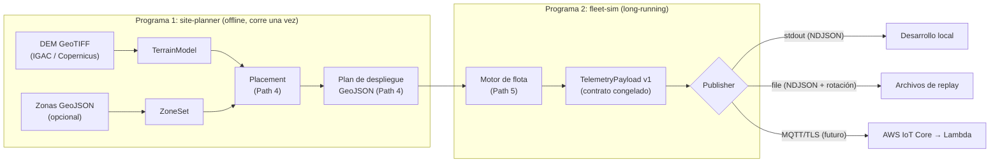

# Guía de arquitectura

**Objetivo de lectura:** entender el diseño completo del subsistema en ~10 minutos,
sin haber visto el código antes.

## El problema

En enero de 2024 los Cerros Orientales de Bogotá ardieron durante días; la detección
tardía fue parte del problema. PyroSense propone una malla de sensores IoT de bajo
costo (temperatura, humedad, humo) reportando a una plataforma serverless en AWS que
infiere riesgo de incendio en tiempo real.

Antes de desplegar hardware real hay dos preguntas que responder por software:

1. **¿Dónde poner los sensores?** — lo responde el **site-planner**.
2. **¿Aguanta la plataforma el tráfico real de la flota?** — lo responde el **fleet-sim**,
   que genera telemetría realista para desarrollar y probar el backend sin hardware.

Este repositorio contiene ambos programas. La infraestructura AWS vive en otro repo.

## Vista de pájaro

## Los módulos y su responsabilidad

| Módulo | Responsabilidad (una sola) | Estado |
|---|---|---|
| `contracts/telemetry.py` | Definir y validar el payload v1 — la frontera con la nube | ✅ congelado |
| `contracts/export_schema.py` | Materializar el contrato como JSON Schema para consumidores no-Python | ✅ |
| `publishers/base.py` | La abstracción `Publisher` (publish/close) de la que depende todo lo demás | ✅ |
| `publishers/ndjson.py` | Única fuente de verdad del formato de línea NDJSON | ✅ |
| `publishers/stdout.py`, `publishers/file.py` | Transportes sin AWS: desarrollo y replay | ✅ |
| `planner/terrain.py` | DEM → consultas de elevación y pendiente (normaliza a EPSG:4326) | ✅ |
| `planner/zones.py` | Polígonos de prioridad T1/T2/T3 y clasificación de puntos | ✅ |
| `planner/geo.py` | Conversión grados↔metros (única fuente de la aproximación) | ✅ |
| `planner/placement.py` | Rejilla hexagonal por tier con jitter sembrado y reubicación por pendiente | ✅ |
| `planner/gateways.py` | Clustering k-means de nodos y snap de gateways a terreno alto (solo metadato) | ✅ |
| `planner/site_plan.py` | Ensambla el plan y serializa los 3 artefactos deterministas | ✅ |
| `planner/params.py` / `planner/cli.py` | Configuración YAML validada en frontera + CLI typer (`site-planner`) | ✅ |
| `fleet/config.py` | Frontera del escenario YAML (pydantic estricto) | ✅ |
| `fleet/environment.py` | Verdad de terreno pura: ciclo diurno, lapse rate, humedad anticorrelacionada | ✅ |
| `fleet/node.py` | El instrumento ruidoso: RNG propio, `seq`, batería, cadencia adaptativa | ✅ |
| `fleet/scheduler.py` | Reloj simulado con aceleración y orden determinista de emisiones | ✅ |
| `fleet/orchestrator.py` / `fleet/cli.py` | Composición (DIP) + CLI `fleet-sim` cancelable con resumen | ✅ |
| `fleet/fire_event.py` | Fuego paramétrico: firma multi-sensor plausible, no física (ADR-0011) | ✅ |
| `fleet/faults.py` | Inyector de fallos como decorador del `Publisher` (ADR-0012) | ✅ |
| `publishers/` (MQTT) | Transporte AWS IoT Core | ⏳ Path 7 |

## Cómo fluyen los datos

1. **Tiempo de planificación (una vez):** `site-planner generate` carga un DEM real
   (`TerrainModel` reproyecta a EPSG:4326 si hace falta), clasifica el área en tiers
   (`ZoneSet`, con derivación por defecto documentada si no hay polígonos del usuario),
   coloca los nodos en rejilla hexagonal por densidad de tier (con jitter sembrado y
   reubicación cuando la pendiente supera el umbral), agrupa gateways por k-means y
   emite tres artefactos **deterministas** (misma semilla ⇒ bytes idénticos, ADR-0007):
   `sensores.geojson` (la entrada del fleet-sim; esquema estable), `gateways.geojson`
   y `site-report.md`.
2. **Tiempo de simulación (continuo):** `fleet-sim run` lee ese plan, instancia un
   `SensorNode` por feature y avanza un reloj simulado con aceleración configurable
   (`--speed`). Cada nodo consulta la verdad de terreno (`EnvironmentModel`, puro y
   determinista), le aplica su propio ruido de sensor sembrado (ADR-0009), y emite
   `TelemetryPayload` validados hacia un `Publisher` inyectado — stdout y archivo hoy,
   MQTT/IoT Core en el Path 7. Cambiar de transporte es un cambio de wiring, no de
   código. Los datos salen por stdout y los logs por stderr (ADR-0010); Ctrl-C cierra
   limpio con resumen.

## Las fronteras (y por qué el contrato es sagrado)

El único punto donde este subsistema toca al resto de PyroSense es el
**payload de telemetría v1** ([guía del contrato](data-contract.md)). Decisiones que lo protegen:

- `extra="forbid"` + modelo frozen: un productor v1 no puede emitir nada que un
  consumidor v1 no entienda. Falla rápido y del lado del productor.
- `schema_version` literal: la evolución es **por versión nueva**, nunca editando v1.
- JSON Schema versionado en `docs/payload-schema-v1.json` con test anti-drift: el
  equipo cloud puede construir la Lambda sin instalar este paquete.

Ver [ADR-0002](adr/ADR-0002-contrato-primero.md) y [ADR-0003](adr/ADR-0003-pydantic-frontera.md).

## Decisiones estructurales clave

- **Dos programas, no uno**: planificar (offline, geoespacial-pesado) y simular
  (long-running, I/O-pesado) tienen ciclos de vida y dependencias distintos —
  [ADR-0001](adr/ADR-0001-dos-programas.md).
- **Pydantic solo en la frontera; dataclasses adentro** —
  [ADR-0003](adr/ADR-0003-pydantic-frontera.md).
- **El sensor reporta salud, no alertas**: la detección de fuego es de la nube —
  [ADR-0005](adr/ADR-0005-sensor-no-alerta.md).
- **Git Flow simplificado** (`main` / `develop` / `feature/*`) —
  [ADR-0004](adr/ADR-0004-git-flow.md).
